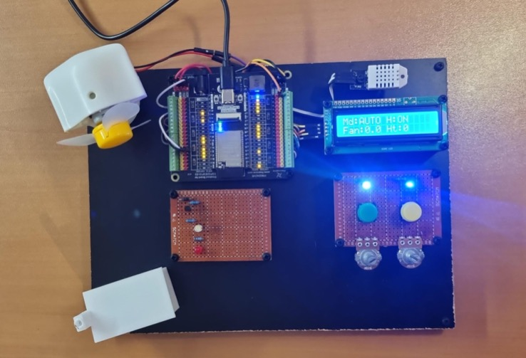

# Mini-HVAC IoT System — ESP32 + Simulink Hardware-in-the-Loop



A hardware-in-the-loop mini-HVAC platform pairing a five-subsystem Simulink model (thermal zone, thermostat logic, PID control, alarm management, and serial interface) with an ESP32-WROVER running custom FreeRTOS firmware. The ESP32 and Simulink exchange sensor readings and actuator commands over a validated binary serial protocol using 24-byte and 32-byte packed structs. Built as a final project for the course *Sistemas Digitales Programables* at UCAM.

## Documentation

| # | Document | Description |
|---|----------|-------------|
| 1 | [System Overview](docs/01-system-overview.md) | Global architecture and subsystem interconnections |
| 2 | [Plant Model](docs/02-plant-model.md) | `MiniHVAC_Zone` physical zone model (thermal + humidity dynamics) |
| 3 | [Thermostat Logic](docs/03-thermostat-logic.md) | `Thermostat_Logic` setpoint and mode management |
| 4 | [Control System](docs/04-control-system.md) | `Control_Simulink` PID controller for temperature and humidity |
| 5 | [Alarms](docs/05-alarms.md) | `Alarms_Logic` threshold monitoring and fault detection |
| 6 | [Serial Protocol](docs/06-serial-protocol.md) | Binary TX/RX encoding tests and byte-packing validation |
| 7 | [ESP32 Interface](docs/07-esp32-interface.md) | `ESP32_Interface` Simulink block for serial communication |
| 8 | [FreeRTOS Firmware](docs/08-freertos-firmware.md) | FreeRTOS task architecture and serial integration |
| 9 | [Hardware Build](docs/09-hardware-build.md) | Prototype assembly, wiring schematics, and component layout |
| 10 | [Integration Testing](docs/10-integration-testing.md) | End-to-end ESP32–Simulink communication tests and results |
| 11 | [Setup Guide (macOS)](docs/11-setup-guide-macos.md) | MATLAB R2025b + ESP32 toolchain installation and troubleshooting |

## Repository Structure

```
sdp-minihvac/
├── config/                  # ESP32 core overrides (platform.local.txt, boards.local.txt)
├── docs/                    # Technical documentation (11 chapters)
├── final/                   # Final integrated firmware (MiniHVAC_Integrado_Simulink)
├── firmware/                # ESP32 firmware iterations
│   ├── 1_Basicos/           # Basic component sketches (DHT22, LCD, PWM, buzzer)
│   ├── 2_B1_Comunicacion_Serial/  # Serial struct TX/RX experiments
│   ├── 3_B2_FreeRTOS_Comunicacion/ # FreeRTOS-based serial integration
│   └── 4_MiniHVAC_Integrado/      # Full integrated firmware with LCD task
├── images/                  # Diagrams, schematics, scope captures, photos
├── models/                  # Simulink models (MiniHVAC_Top, TX_ESP32, RX_ESP32)
├── schematics/              # Fritzing schematics and architecture diagrams
├── scripts/                 # MATLAB test scripts for byte-packing validation
└── tests/                   # Simulink test harnesses for each subsystem
```

## Tech Stack

- **MCU:** ESP32-WROVER (ESP32-D0WD-V3)
- **Simulation:** MATLAB/Simulink R2025b
- **Firmware:** Arduino framework + FreeRTOS
- **Sensors:** DHT22 (temperature + humidity)
- **Display:** I2C LCD 16x2
- **Actuators:** PWM fan control, heater relay, buzzer

## Quick Start

There are two ways to use this repository:

1. **Browse the documentation** — start with the [System Overview](docs/01-system-overview.md) and follow the numbered docs sequentially. Each chapter is self-contained with embedded diagrams.

2. **Run the models and firmware** — clone the repo, open `models/MiniHVAC_Top.slx` in Simulink R2025b, and flash the ESP32 with the firmware in `final/MiniHVAC_Integrado_Simulink/`. See the [Setup Guide](docs/11-setup-guide-macos.md) for toolchain configuration.

## License

[MIT](LICENSE)
