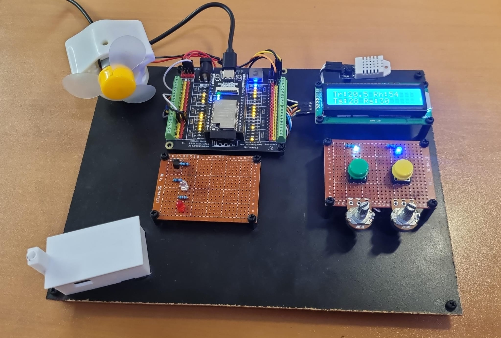
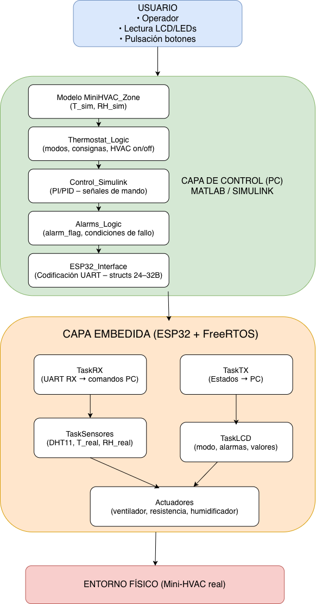
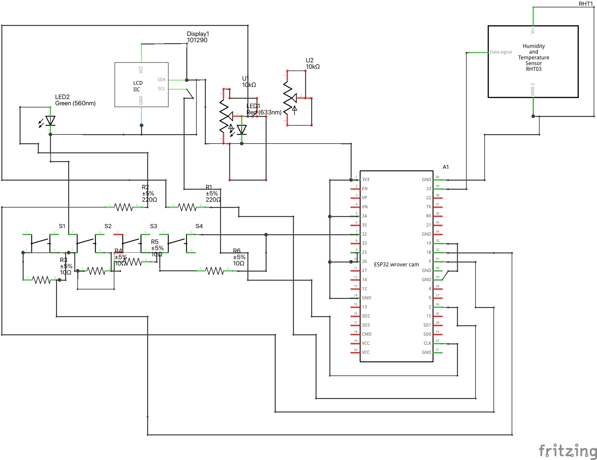
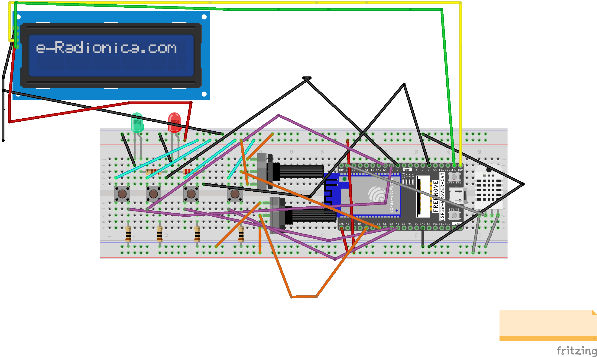

# Hardware Build & Prototype

## Phase 3 — First hardware assembly and physical integration

### Objective of the physical build

In Phase 3, the goal was to move from a purely simulated model in Simulink (Phase 2) to a fully integrated system with real hardware based on an ESP32-Wrover. For this purpose, firmware was developed that:

- Implements binary serial communication with Simulink using the `PcToEsp` and `EspToPc` structures.
- Manages sensors, actuators, and communication concurrently using FreeRTOS tasks.
- Exposes a basic user interface through potentiometers (setpoints), buttons (mode and HVAC enable), and LEDs/fan as physical actuators.

The physical build is centered on integrating sensors, actuators, and user-interface elements with the ESP32-Wrover while maintaining compatibility with the binary protocol designed for Simulink.

### Firmware associated with the first build

The code for integrating the ESP32-Simulink modules is located at:

```text
firmware/3_B2_FreeRTOS_Comunicacion/
B2_FreeRTOS_TX_RX_Integracion_v1/B2_FreeRTOS_TX_RX_Integracion_v1.ino
```

### Components and functions integrated in Phase 3

The Phase 3 firmware block defines all physical pins in the system, including actuators, the temperature and humidity sensor, potentiometers, and buttons. The document does not provide a table with explicit GPIO numbers, so the functional naming used in the report is preserved.

| Component / module | Signal or function | Extracted technical description |
|---|---|---|
| ESP32-Wrover | Main microcontroller | Real hardware platform of the MiniHVAC system. It runs serial communication, sensor reading, user-input handling, and actuator control through FreeRTOS. |
| DHT22 sensor | `T_real`, `RH_real` | Temperature and humidity sensor. Its readings are validated by checking that they are not `NaN`. |
| DC fan | `u_fan_real`, `u_fan_sim`, PWM | Physical actuator controlled through a PWM channel. The firmware configures PWM at 25 kHz with 8-bit resolution. |
| Symbolic heater / LED | `u_heater_real`, `u_heater_sim` | LED that simulates heater operation. It is enabled/disabled through `setHeaterOutput(level)`. |
| Alarm LED/buzzer | `alarm_flag` | Physical alarm output driven by `setAlarmOutputs(alarm)`. It is activated when `alarm_flag > 0.5f`. |
| Temperature potentiometer | `T_set` | Analog input converted into an approximate physical setpoint of 18–28 ºC. |
| Humidity potentiometer | `RH_set` | Analog input converted into an approximate physical setpoint of 30–70 %RH. |
| Mode button | `mode_auto_manual` | Digital input used to select AUTO/MANUAL mode. |
| Enable button | `hvac_enable` | Digital input used to globally enable or disable HVAC. |
| UART serial port | `PcToEsp`, `EspToPc` | Binary communication with Simulink at 115200 baud. |

### Hardware integration: pins, sensors, and actuators

The following firmware block defines all physical pins in the system, including actuators (fan via PWM, heater/LED, alarm LED), the temperature and humidity sensor (DHT22), potentiometers for `T_set` and `RH_set`, and buttons for AUTO/MANUAL mode and HVAC enable.

In addition, a PWM channel is configured to control the fan at **25 kHz** with **8-bit** resolution, meeting the requirement of integrating physical actuator control in parallel with serial communication.

In the `setup()` function, the following elements are initialized:

- The serial port (**115200 baud**).
- The actuator pins.
- The DHT sensor.
- The digital inputs with `INPUT_PULLUP`.
- The fan PWM.
- The communication structures set to zero.
- A coherent initial state, for example MANUAL mode and HVAC enabled.

### Actuator abstraction functions

To decouple the logic from the rest of the code, abstraction functions such as `setFanPwm()`, `setHeaterOutput()`, and `setAlarmOutputs()` are introduced.

| Function | Associated physical function |
|---|---|
| `setFanPwm(duty)` | Controls the fan. It limits the duty cycle to the `[0, 1]` range and converts it to an integer value according to the PWM resolution. |
| `setHeaterOutput(level)` | Controls the heater/LED. It enables or disables the heater pin according to a threshold. |
| `setAlarmOutputs(alarm)` | Controls the alarm LED/buzzer. It turns the alarm on or off according to the value of `alarm_flag`. |

This design makes future improvements easier, such as changing the fan or heater hardware, without modifying the integration logic with Simulink.

### Sensor and user-input acquisition

The `updateSensorsAndInputs(espState)` function brings together the temperature and humidity sensor reading, the potentiometer readings for the setpoints, and the button readings for the mode and global enable state in one place:

- `T_real` and `RH_real` are read from the DHT22, checking that the data is not `NaN`.
- The potentiometer values are converted into approximate physical setpoints for `T_set` (for example, **18–28 ºC**) and `RH_set` (for example, **30–70 %RH**).
- The buttons are read to set `mode_auto_manual` and `hvac_enable`.
- `u_fan_real` and `u_heater_real` are updated with the latest commands received from Simulink.

With this, the ESP32 becomes the source of truth for the real variables sent to Simulink to close the loop with the modules designed in Phase 2.

### Applying commands received from Simulink to the hardware

The `applyPCCommands(cmd)` function is responsible for closing the integration between the commands from Simulink and the physical actuators. Based on the `PcToEsp` structure:

- `setFanPwm(cmd.u_fan_sim)` makes the fan follow the simulated command.
- `setHeaterOutput(cmd.u_heater_sim)` turns the heater/LED on or off.
- `setAlarmOutputs(cmd.alarm_flag > 0.5f)` activates the alarm LED/buzzer when Simulink detects an alarm condition.

This block implements the requirement to integrate serial communication with LED and actuator control in a single firmware application.

### Schematics and configurations documented in Phase 3

The different Phase 2 documents refer to electrical and wiring schematics (for example, fan, LED, resistor, sensor, and ESP32 connection schematics) developed using tools such as Tinkercad or Fritzing.

These images are not included in this unified document, but their existence and use during testing are recorded. In the final course submission, it is recommended to attach these schematics as images or additional documents, referencing them from this section.

TODO: explicitly list the schematics used (file name, tool used, and a brief description of their contents).


MiniHVAC system block diagram (system view).


Author-created schematic: wiring schematic for several components.

The following schematic needs the wiring to be reorganized and additional electronic components to be added; however, it is included because it was the first attempt, and learning to use this tool will make it easier to visualize the connections for the final project submission.


Figure 1. Author-created schematic: first Fritzing prototype schematic.

### Notes and issues from the first build

During integration and testing, several points requiring adjustment were identified:

- **Serial packet synchronization:** it was necessary to ensure that `TaskRX` only processes packets when `Serial.available()` is greater than or equal to the size of `PcToEsp`, avoiding partial reads.
- **DHT sensor latency:** the transmission period and sensor-reading management were adjusted to avoid invalid readings (`NaN`) and to respect the minimum time between measurements.
- **Initial states:** `mode_auto_manual` and `hvac_enable` were explicitly initialized to coherent values (MANUAL/ON) to avoid unexpected behavior at startup.

These adjustments made it possible to stabilize the system and leave it ready for real-time demonstrations.

## Phase 4 — Final prototype on board

### Prototype evolution: from breadboard to final board

During the first phases of the project, the hardware was assembled on conventional breadboards, using jumper wires that made quick tests easier but complicated the presentation and robustness of the build.

For Phase 4, the system was completely reassembled on a rigid wooden base, using:

- Solderable protoboards (perforated boards) to mount the components.
- `standoffs` and screws to raise and secure the boards.
- Physical organization by zones to make each module easier to identify.

This produced a much cleaner, more organized, and more presentable prototype, suitable for the classroom demonstration and final evaluation.

### Physical organization of the modules on the board

The following figure shows the final prototype:



Final MiniHVAC prototype mounted on a board.

From the photograph, the following subassemblies can be clearly identified:

| Functional zone | Physical location | Description |
|---|---|---|
| ESP32 module + terminal board | Left zone | The expansion board with terminal strip connections and the ESP32-Wrover module, powered by USB, are located on the left side. From this board, the signals are distributed to the other modules (fan, LCD, DHT22, buttons, LEDs, etc.). |
| Ventilation module | Upper-left area | A DC fan/motor with a plastic housing and propeller is mounted, powered from the ESP32 through the PWM channel configured in the firmware. |
| User-interface module | Lower-right zone | Perforated board with two potentiometers (for `T_set` and `RH_set`) and two large pushbuttons used for `mode_auto_manual` and `hvac_enable`. Two blue LEDs have been placed next to them to help visualize the signal states. |
| Indicator and alarm module | Middle-left area | Second perforated board with several LEDs and resistors that turn on when the fan or heater is active. Additional outputs have also been left available for future extensions, such as alarms or debugging signals. |
| Display and sensor module | Upper-right area | 16x2 I2C LCD next to a DHT22 sensor, allowing the user to read the real temperature and humidity values on the display at the same time. |
| Space for humidification / future expansion | Lower-left corner | Reserved area for future elements, such as an ultrasonic fogger or a small water tank, to simulate the humidification branch of MiniHVAC. |

This organization makes the system much easier to explain, since each physical block corresponds to a clearly identifiable set of functions.

### Pins, sensors, actuators, and LCD declared in the final firmware

In the final firmware, the pins used are declared for:

| Category | Signals / identifiers | Function |
|---|---|---|
| Actuators | `PIN_FAN_PWM` | PWM channel for the DC fan. |
| Actuators | `PIN_HEATER` | LED that simulates the heater. |
| Actuators | `PIN_ALARM_LED` | Alarm LED/buzzer. |
| Temperature and humidity sensor | `PIN_DHT` | Connected to a DHT22 sensor. |
| User interface | `PIN_POT_TSET`, `PIN_POT_RHSET` | Temperature and humidity setpoints. |
| User interface | `PIN_BTN_MODE`, `PIN_BTN_HVAC` | AUTO/MANUAL and HVAC ON/OFF buttons. |
| Status LEDs | `PIN_LED_HVAC`, `PIN_LED_MODE` | Visually reflect the state of the `hvac_enable` and `mode_auto_manual` flags. |
| I2C LCD display | `I2C_SDA_LCD`, `I2C_SCL_LCD` | I2C pins for the 16x2 LCD. |
| I2C LCD display | `LiquidCrystal_I2C lcd(0x3F, 16, 2)` | 16x2 LCD with I2C address `0x3F`. |

A PWM channel is configured for the fan at **25 kHz** with **8-bit** resolution, allowing smooth airflow control. In `setup()`, the serial port, pins, DHT sensor, LCD (including the welcome message “MiniHVAC ESP32 – Inicializando…”), and FreeRTOS tasks are initialized.

In this version, the initial state is set to **AUTO** and **HVAC ON**, which is more consistent with the automatic-control demos.

### Complementary schematics reproduced in Phase 4

The F4 submission also preserves the reference schematics used during development, included as configuration appendices and visual documentation of the system.



MiniHVAC system block diagram (system view), reproduced in the F4 documentation.



Author-created schematic: wiring schematic for several components, reproduced in the F4 documentation.



Figure 1. Author-created schematic: first Fritzing prototype schematic, reproduced in the F4 documentation.

### Summary of the final physical prototype

The MiniHVAC project has evolved from a conceptual model in Simulink into a complete hardware-software system based on an ESP32-Wrover:

- In Phase 2, the Simulink subsystems (`MiniHVAC_Zone`, `Thermostat_Logic`, `Control_Simulink`, `Alarms_Logic`, and `ESP32_Interface`) were designed, defining the simulated plant and control architecture.
- In Phase 3, the initial ESP32 firmware was implemented, integrating binary serial communication, sensor reading, and actuator control under FreeRTOS.
- In Phase 4, the integration was consolidated:
  - Correction of the handling of the `mode_auto_manual` and `hvac_enable` buttons with robust debounce and `toggle` behavior.
  - Incorporation of `TaskLCD` as a local visualization interface.
  - Reassembly of the hardware into a final, organized, and presentable board.
  - Execution of extensive tests and recording of three video demonstrations.

The result is an educational test bench that makes it possible to experiment with temperature and humidity control in a semi-realistic environment, combining mathematical modeling in Simulink with embedded systems programming on ESP32.

## Extracted images used in this file

| File | Source | Use in the document |
|---|---|---|
| `../images/f3-system-block-diagram.png` | F3 | Block diagram (system view). |
| `../images/f3-multi-component-wiring-schematic.png` | F3 | Wiring schematic for several components. |
| `../images/f3-first-fritzing-prototype-schematic.png` | F3 | First Fritzing prototype schematic. |
| `../images/f4-final-board-prototype-layout.png` | F4 | Photograph of the final MiniHVAC prototype mounted on a board. |
| `../images/f4-system-block-diagram.png` | F4 | Block diagram reproduced in F4. |
| `../images/f4-multi-component-wiring-schematic.png` | F4 | Wiring schematic reproduced in F4. |
| `../images/f4-first-fritzing-prototype-schematic.png` | F4 | First Fritzing prototype schematic reproduced in F4. |
