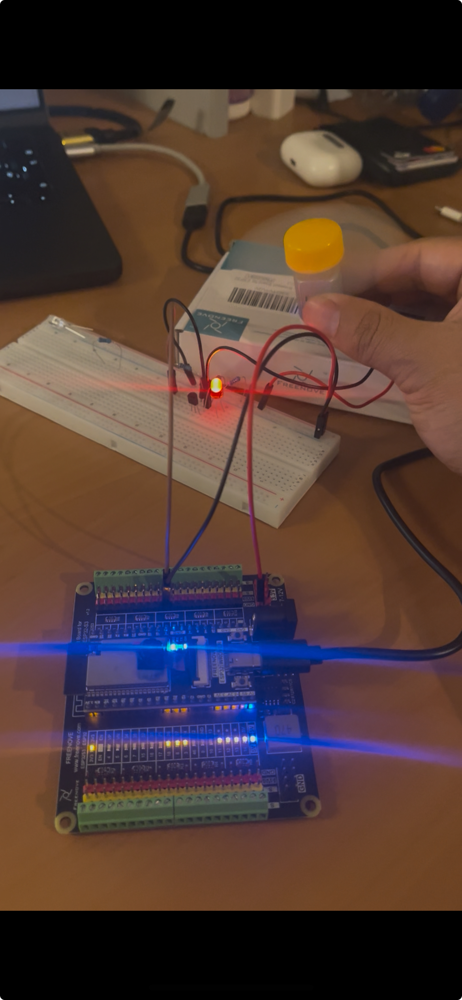
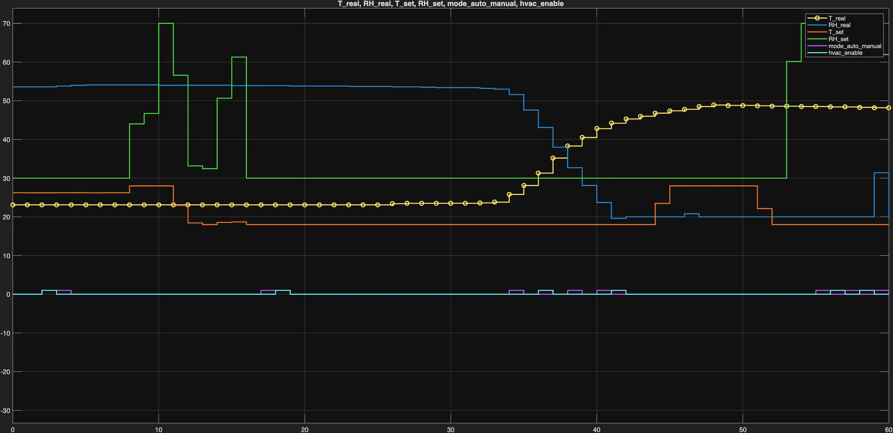

# Integration Testing & Results

## Phase 3 — Initial ESP32–Simulink Integration Tests

### Tests on `ESP32_Interface` and Serial Communication

The Simulink test models are located at:

```text
models/RX_ESP32.slx
```

or alternatively:

```text
models/TX_ESP32.slx
```

The code used to develop the ESP32-Simulink tests is located at:

```text
firmware/3_B2_FreeRTOS_Comunicacion/
B2_FreeRTOS_TX_RX_Minimo/B2_FreeRTOS_TX_RX_Minimo.ino
```

Simulink models for TX and RX tests.

The serial communication tests between Simulink and the ESP32 have been organized into two complementary levels.

### MATLAB Encoding/Decoding Tests

Scripts were developed in the `Scripts_MATLAB/` folder, including, among others:

| Script | Purpose |
|---|---|
| `TEST_TX_To_ESP32_bytes.m` | Generates test data structures in MATLAB and verifies that, after passing through the Simulink packing blocks, the resulting byte vector matches the one defined for the `PcToEsp` structure (24 bytes) in C. |
| `TEST_RX_From_ESP32_bytes.m` | Starts from byte vectors constructed according to the `EspToPc` structure (32 bytes) and verifies that, after unpacking in Simulink, the reconstructed signals match the expected values. |

These tests validate that data encoding and decoding are consistent between MATLAB/Simulink and the C firmware before connecting real hardware.

### Simulink–ESP32 Communication Tests

Based on this foundation, Simulink test models were defined for real communication with the ESP32 board, verifying that:

- The ESP32 correctly receives the commands sent from Simulink (for example, activating an LED or a small fan after a certain simulation time).
- The data sent by the ESP32 (sensor measurements and actuator states) are correctly received and displayed in Simulink.


Fan motor and LED connection test using the Simulink `TX_ESP32` model.

In these tests, FreeRTOS was used on the ESP32 to organize the sensor-reading, actuator-update, and serial-communication tasks, ensuring suitable response times for an almost real-time simulation.

Overall, the `ESP32_Interface` tests confirm that the proposed data structure and serial communication approach are viable and provide the foundation for a more complete hardware-in-the-loop integration in the third phase of the project.

### ESP32 → Simulink Test: `RX_From_ESP32` Model

Data reception is demonstrated using a Scope in Simulink.

The Scopes show:

- `T_real`, `RH_real` following the DHT sensor.
- `T_set`, `RH_set` changing with the potentiometers.
- `mode_auto_manual`, `hvac_enable` as 0/1 values according to the buttons.


### Phase 3 Full-System Operation Tests

Once all modules were integrated into the ESP32 firmware, final tests were performed under different usage scenarios, checking both individual behavior and joint operation with Simulink.

#### Tests with Simulink and AUTO Mode

In the full-system tests:

1. Simulink runs the `MiniHVAC_Top` model, generating `PcToEsp` structures with the simulated variables (`T_sim`, `RH_sim`, `P_sim`), the automatic commands (`u_fan_sim`, `u_heater_sim`), and `alarm_flag`.
2. The ESP32 periodically receives these structures in `TaskRX`, stores them in `pcCmd`, and updates the physical actuators with `applyPCCommands()`.
3. In parallel, `TaskTX` reads `T_real` and `RH_real` from the DHT sensor, calculates `T_set` and `RH_set` from the potentiometers, reads the mode and enable buttons, updates `espState`, and sends the `EspToPc` structure back to Simulink.

This cycle verified consistency between the simulated commands and the physical response of the fan and heater, as well as the correct propagation of setpoints and mode flags to the `Thermostat_Logic` and `Control_Simulink` blocks.

#### MANUAL and Local Mode Tests

In addition, tests were performed in which the system is used more autonomously:

- The mode is forced to MANUAL using the corresponding button (`mode_auto_manual = 0`).
- The setpoints are set from the potentiometers, and the effect on the fan and heating is observed based only on the firmware and the logic defined for manual mode.

These tests make it possible to verify the operation of the physical interface without requiring a complete automatic control loop, and to confirm that the actuator states sent in `EspToPc` match the real hardware.

#### Issues Found and Adjustments Made

During integration and testing, several points requiring adjustment were identified:

- **Serial packet synchronization:** it was necessary to ensure that `TaskRX` only processes packets when `Serial.available()` is greater than or equal to the size of `PcToEsp`, avoiding partial reads.
- **DHT sensor latency:** the transmission period and sensor-reading management were adjusted to avoid invalid readings (`NaN`) and to respect the minimum time between measurements.
- **Initial states:** `mode_auto_manual` and `hvac_enable` were explicitly initialized with consistent values (MANUAL/ON) to avoid unexpected behavior at startup.

These adjustments stabilized the system and left it ready to be used in real-time demonstrations.

### Phase 3 Results Summary

In Phase 3, the hardware–software integration of the MiniHVAC project was completed:

- The ESP32-Wrover was robustly connected to the `MiniHVAC_Top` model through a well-defined binary protocol.
- Serial communication, sensor reading, user input handling, and actuator control were successfully executed in parallel thanks to FreeRTOS.
- Full-system operation tests were performed in different scenarios (AUTO mode with Simulink and local MANUAL mode), identifying and correcting synchronization issues, initial-state problems, and sampling-time issues.
- Improvement and optimization criteria were applied both at the code-organization level and in terms of time and resource management on the microcontroller.

As part of the final deliverable, two videos were added showing the system operating in real time, where the interaction between Simulink, the ESP32, the sensors, and the physical actuators can be observed. These videos serve as a visual demonstration of the integration achieved in this phase.

## Phase 4 — Final Demonstrations and Results

### Full-System Operation Tests

In Phase 4, the hardware–software integration tests were repeated and expanded, focusing on:

- Verifying the corrected button handling and the LED states.
- Confirming that the values shown on the LCD match the values sent to Simulink.
- Checking that no visible bouncing or erratic “jumps” occur in the `mode_auto_manual` and `hvac_enable` signals.

The tests were documented through three main videos, also described in Block III:

| Video | Result shown |
|---|---|
| `F4_DEMO_IniciandoESP32.mp4` | Shows the ESP32 startup sequence, the initial LCD message, and the initial button state. |
| `F4_DEMO_PruebaComponentes_Simulink.mp4` | Full test of sensors, potentiometers, fan, and LEDs, while simultaneously observing the `T_real`/`T_sim` and `RH_real`/`RH_sim` scopes in Simulink. |
| `F4_DEMO_SeñalBotones.mp4` | The buttons are pressed repeatedly while the status LEDs and logical signals in the Simulink scopes are observed changing in real time. |

The results confirm that:

- The buttons generate clean transitions between high and low states.
- The LEDs and LCD are consistent with the state of `mode_auto_manual` and `hvac_enable`.
- Data exchange with Simulink is stable, with no noticeable packet loss in the tests performed.

### Real-Time Demonstrations

As part of the final deliverable, three demonstration videos were recorded showing the system behavior in real time. The files are located in the folder:

```text
images/
```

#### `F4_DEMO_IniciandoESP32.mp4`

- Shows the ESP32 startup sequence on the final board.
- The initial LCD message (“MiniHVAC ESP32 – Inicializando…”) and the status LEDs turning on according to the initial values of `mode_auto_manual` and `hvac_enable` can be observed.
- This demo illustrates the correct initialization of the firmware, the I2C communication, and the state structures.

#### `F4_DEMO_PruebaComponentes_Simulink.mp4`

- A systematic hardware component test is performed while Simulink is running the `MiniHVAC_Top` model.
- The setpoints are modified with the potentiometers, the fan behavior is observed, and the `T_real` and `RH_real` variables change in the Simulink scopes (one dedicated to temperature and another to relative humidity).
- The video demonstrates synchronization between the physical prototype and the simulated plant.

#### `F4_DEMO_SeñalBotones.mp4`

In this demo, the `mode_auto_manual` and `hvac_enable` buttons are pressed repeatedly while observing:

- The corresponding status LEDs turning on and off.
- Clear transitions from “0” to “1” and vice versa in the logical signals displayed in Simulink.
- This validates the debounce algorithm and the “thermostat-like” behavior, where the state is retained until the next button press.

These demonstrations complement the written documentation and provide visual confirmation that the system responds in a stable, consistent, and reproducible way.

### Additional Captures Reproduced in Phase 4 Appendices

The F4 deliverable also preserves serial communication verification captures and ESP32 → Simulink data reception captures, included as appendices in the final documentation.



Fan motor and LED connection test using the Simulink `TX_ESP32` model, reproduced in F4.



Simulink Scope for ESP32 → Simulink reception, reproduced in F4.

### Final System Performance Summary

The MiniHVAC project evolved from a conceptual Simulink model into a complete ESP32-Wrover-based hardware–software system:

- In Phase 2, the Simulink subsystems (`MiniHVAC_Zone`, `Thermostat_Logic`, `Control_Simulink`, `Alarms_Logic`, and `ESP32_Interface`) were designed, defining the simulated plant and the control architecture.
- In Phase 3, the initial ESP32 firmware was implemented, integrating binary serial communication, sensor reading, and actuator control under FreeRTOS.
- In Phase 4, the integration was consolidated:
  - Correction of `mode_auto_manual` and `hvac_enable` button handling with robust debounce and “toggle” behavior.
  - Addition of `TaskLCD` as a local visualization interface.
  - Reassembly of the hardware into a clean and presentable final board.
  - Completion of extensive tests and recording of three demonstration videos.

The result is an educational test bench that enables experimentation with temperature and humidity control in a semi-realistic environment, combining mathematical modeling in Simulink with embedded systems programming on ESP32.

## Extracted Images Used in This File

| File | Source | Use in the document |
|---|---|---|
| `../images/f3-tx-esp32-motor-led-test.png` | F3 | Motor/fan and LED connection test using Simulink `TX_ESP32` model. |
| `../images/f3-rx-from-esp32-simulink-scope.png` | F3 | Simulink Scope for ESP32 → Simulink data reception (`RX_From_ESP32`). |
| `../images/f4-tx-esp32-motor-led-test.png` | F4 | Motor/fan and LED connection test reproduced in F4 appendices. |
| `../images/f4-rx-from-esp32-simulink-scope.png` | F4 | Simulink Scope for ESP32 → Simulink reception reproduced in F4 appendices. |
